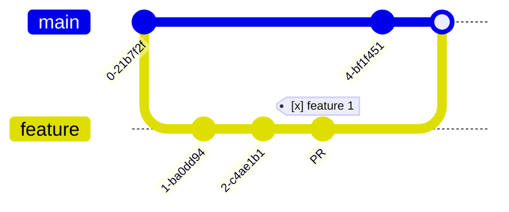

### Configuration Item
#### Issues

#### Releases, Plans
:date: 2024-11-23 Release

### Flow, Flow Instance
### Works
---
:date: 2024-11-23
:lock: locked by [blocker](#issues)
:unlock: locker solved
:dart: goal
:bookmark: bookmark
:memo:
:phone: call somebody 
:beer:
<mark>on track</mark>
:warning: warning
:repeat: repeat weekly
:recycle: recycle
:x: canceled
:link: link

